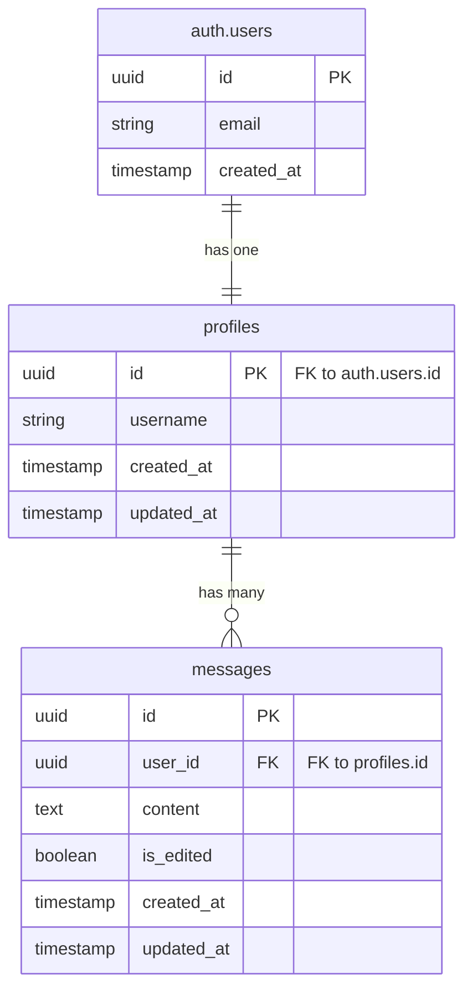
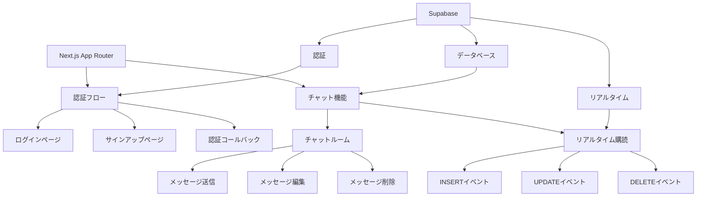

# Supabase Chat App


## 📋 概要

Supabase + Next.js で構築されたリアルタイムチャットアプリケーションです。メール認証・Google 認証に対応し、リアルタイムでメッセージの送受信、編集、削除が可能です。Row Level Security (RLS) を実装し、セキュアなデータアクセス制御を行っています。

## ✨ 機能

### 認証機能

- ✅ **メール認証**: メールアドレスとパスワードによる認証
- ✅ **Google 認証**: OAuth2.0 を使用した Google アカウントでのログイン
- ✅ **アカウント作成**: ユーザー名、メールアドレス、パスワードで新規登録
- ✅ **セッション管理**: Supabase Auth によるセキュアなセッション管理

### チャット機能

- ✅ **リアルタイムメッセージング**: Supabase Realtime を使用したリアルタイム通信
- ✅ **メッセージ送信**: テキストメッセージの送信
- ✅ **メッセージ編集**: 送信済みメッセージの編集（編集済みマーク付き）
- ✅ **メッセージ削除**: メッセージの削除
- ✅ **ユーザー表示**: メッセージ送信者のユーザー名表示
- ✅ **タイムスタンプ**: 相対時間表示（例: "3 分前"）

### UI/UX 機能

- ✅ **Toast 通知**: エラー・成功メッセージの表示
- ✅ **レスポンシブデザイン**: モバイル・デスクトップ対応
- ✅ **自動スクロール**: 新しいメッセージ受信時の自動スクロール

### セキュリティ機能

- ✅ **Row Level Security (RLS)**: データベースレベルでのアクセス制御
- ✅ **認証ミドルウェア**: 未認証ユーザーのリダイレクト

## 🛠️ 技術スタック

### フロントエンド

<div align="left">
  
  
  
  
</div>

- **Next.js 16.0.5** - React フレームワーク（App Router）
- **React 19.2.0** - UI ライブラリ
- **TypeScript 5.0** - 型安全性
- **Tailwind CSS 4.0** - ユーティリティファースト CSS

### バックエンド・データベース

<div align="left">
  
</div>

- **Supabase 2.86.0** - BaaS（認証、データベース、リアルタイム）
  - PostgreSQL（データベース）
  - Supabase Auth（認証）
  - Supabase Realtime（リアルタイム通信）
  - Row Level Security（セキュリティ）

### 主要ライブラリ

- **@supabase/ssr 0.8.0** - Supabase SSR サポート
- **@supabase/supabase-js 2.86.0** - Supabase JavaScript クライアント
- **lucide-react 0.555.0** - アイコンライブラリ
- **date-fns 4.1.0** - 日付フォーマット

## 📁 ディレクトリ構成

```
supabase-chat-app/
├── app/
│   ├── auth/
│   │   ├── callback/
│   │   │   └── route.ts          # OAuth認証コールバック
│   │   ├── login/
│   │   │   └── page.tsx          # ログインページ
│   │   └── signup/
│   │       └── page.tsx          # サインアップページ
│   ├── chat/
│   │   ├── ChatRoom.tsx          # チャットルームコンポーネント
│   │   └── page.tsx              # チャットページ
│   ├── components/
│   │   └── Toast.tsx             # Toast通知コンポーネント
│   ├── globals.css               # グローバルスタイル
│   ├── layout.tsx                # ルートレイアウト
│   └── page.tsx                 # ホームページ
├── lib/
│   └── supabase/
│       ├── client.ts             # クライアント側Supabaseクライアント
│       ├── middleware.ts         # ミドルウェア用Supabaseクライアント
│       └── server.ts             # サーバー側Supabaseクライアント
├── types/
│   └── database.ts               # データベース型定義
├── middleware.ts                 # Next.jsミドルウェア
├── package.json
├── tsconfig.json
└── README.md
```

## 🗄️ データベース構成

### ER 図



### テーブル構造

#### `profiles` テーブル

- `id` (uuid, PK): ユーザー ID（users.id と連携）
- `username` (text): ユーザー名
- `created_at` (timestamp): 作成日時
- `updated_at` (timestamp): 更新日時

#### `messages` テーブル

- `id` (uuid, PK): メッセージ ID
- `user_id` (uuid, FK): 送信者 ID（profiles.id と連携）
- `content` (text): メッセージ内容
- `is_edited` (boolean): 編集済みフラグ
- `created_at` (timestamp): 作成日時
- `updated_at` (timestamp): 更新日時

## 🚀 環境構築手順

### 前提条件

- Node.js 20 以上
- npm または yarn
- Supabase アカウント

### 1. リポジトリのクローン

```bash
git clone <repository-url>
cd supabase-chat-app
```

### 2. 依存関係のインストール

```bash
npm install
```

### 3. Supabase プロジェクトの設定

1. [Supabase](https://supabase.com/)でプロジェクトを作成
2. プロジェクト設定から以下を取得：
   - Project URL
   - Anon Key
3. `.env.local`ファイルを作成：

```env
NEXT_PUBLIC_SUPABASE_URL=your-project-url
NEXT_PUBLIC_SUPABASE_ANON_KEY=your-anon-key
```

### 4. データベースセットアップ

Supabase ダッシュボードの SQL Editor で以下を実行：

```sql
-- profilesテーブルの作成
CREATE TABLE profiles (
  id UUID REFERENCES auth.users(id) PRIMARY KEY,
  username TEXT,
  avatar_url TEXT,
  created_at TIMESTAMP WITH TIME ZONE DEFAULT NOW(),
  updated_at TIMESTAMP WITH TIME ZONE DEFAULT NOW()
);

-- 新規ユーザー登録時に自動でプロフィール作成
CREATE OR REPLACE FUNCTION public.handle_new_user()
RETURNS TRIGGER AS $$
BEGIN
  INSERT INTO public.profiles (id, username, avatar_url)
  VALUES (
    NEW.id,
    COALESCE(NEW.raw_user_meta_data->>'username', split_part(NEW.email, '@', 1)),
    NEW.raw_user_meta_data->>'avatar_url'
  );
  RETURN NEW;
END;
$$ LANGUAGE plpgsql SECURITY DEFINER;

CREATE TRIGGER on_auth_user_created
  AFTER INSERT ON auth.users
  FOR EACH ROW EXECUTE FUNCTION public.handle_new_user();

-- messagesテーブルの作成
CREATE TABLE messages (
  id UUID DEFAULT gen_random_uuid() PRIMARY KEY,
  user_id UUID REFERENCES profiles(id) ON DELETE CASCADE,
  content TEXT NOT NULL,
  is_edited BOOLEAN DEFAULT FALSE,
  created_at TIMESTAMP WITH TIME ZONE DEFAULT NOW(),
  updated_at TIMESTAMP WITH TIME ZONE DEFAULT NOW(),

    -- 外部キー制約
  CONSTRAINT messages_user_id_auth_fkey 
    FOREIGN KEY (user_id) REFERENCES auth.users(id) ON DELETE CASCADE,
  CONSTRAINT messages_user_id_profiles_fkey 
    FOREIGN KEY (user_id) REFERENCES profiles(id) ON DELETE CASCADE
);

-- Row Level Security (RLS) の有効化
ALTER TABLE profiles ENABLE ROW LEVEL SECURITY;
ALTER TABLE messages ENABLE ROW LEVEL SECURITY;

-- profilesテーブルのRLSポリシー
CREATE POLICY "Users can view all profiles"
  ON profiles FOR SELECT
  USING (true);

CREATE POLICY "Users can update own profile"
  ON profiles FOR UPDATE
  USING (auth.uid() = id);

-- messagesテーブルのRLSポリシー
CREATE POLICY "Users can view all messages"
  ON messages FOR SELECT
  USING (true);

CREATE POLICY "Users can insert own messages"
  ON messages FOR INSERT
  WITH CHECK (auth.uid() = user_id);

CREATE POLICY "Users can update own messages"
  ON messages FOR UPDATE
  USING (auth.uid() = user_id);

CREATE POLICY "Users can delete own messages"
  ON messages FOR DELETE
  USING (auth.uid() = user_id);

-- インデックス作成
CREATE INDEX messages_created_at_idx ON messages(created_at DESC);
CREATE INDEX messages_user_id_idx ON messages(user_id);

-- リアルタイムの有効化
ALTER PUBLICATION supabase_realtime ADD TABLE messages;
ALTER PUBLICATION supabase_realtime ADD TABLE profiles;
```

### 5. 認証設定

Supabase ダッシュボードで以下を設定：

1. **Authentication > Providers**

   - Email 認証を有効化
   - Google 認証を有効化（必要に応じて）

2. **Authentication > URL Configuration**
   - Redirect URLs に `http://localhost:3000/auth/callback` を追加

### 6. 開発サーバーの起動

```bash
npm run dev
```

ブラウザで [http://localhost:3000](http://localhost:3000) を開きます。

## 📊 プロジェクト構成図



## 🔐 セキュリティ

- **Row Level Security (RLS)**: データベースレベルでのアクセス制御
- **認証ミドルウェア**: 未認証ユーザーの自動リダイレクト
- **セッション管理**: Supabase Auth による安全なセッション管理
- **環境変数**: 機密情報の環境変数管理

## 📝 ライセンス

このプロジェクトは学習目的で作成されています。個人利用・学習用途での使用を想定しています。

---

**注意**: 本アプリケーションは学習用のサンプルアプリケーションです。本番環境で使用する場合は、適切なセキュリティ対策とパフォーマンス最適化を行ってください。
